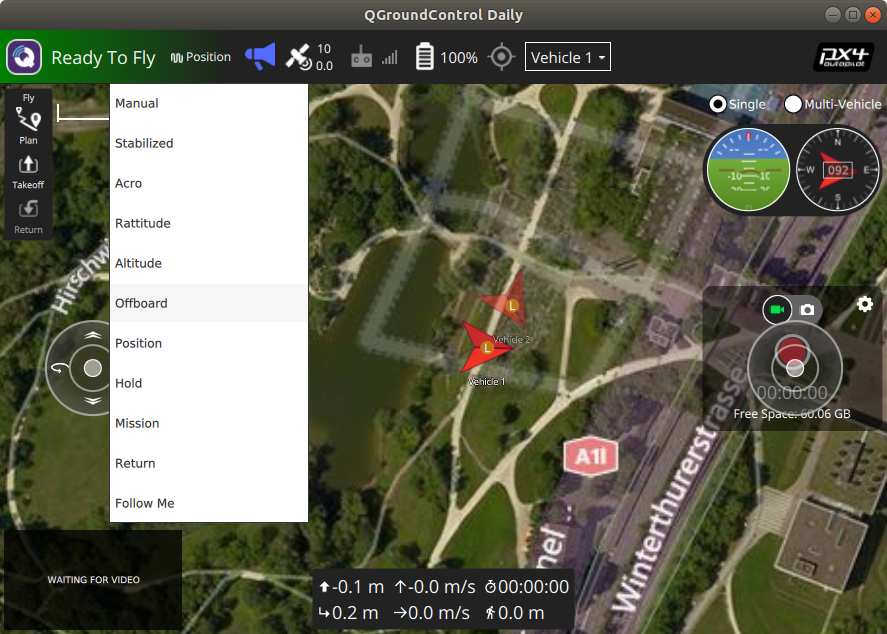

# target_following

## Prerequisites
---
Ubuntu LTS 18.04

ROS Melodic

[Setup PX4, QGC and MavROS](https://github.com/dylantzx/PX4)

## About
---
This repository has target following codes with only **yaw control** based on simple algorithms of:
1. Finding the angle required to yaw then yaw at a constant speed to face the target. [continuous_yaw_test_1.cpp]
2. Using the distance travelled by the target in a second, as the predicted distance travelled in the next second. Then find angle required to yaw based off cosine rule. [continuous_yaw_test_2.cpp]
3. Same as `continuous_yaw_test_2.cpp` but attempts to control forward and backward movement (incomplete) [continuous_yaw.cpp]

**Values are currently based off ground-truth gazebo values**

## How to use the codes
---
1. Clone the repository into your `catkin_ws/src/` directory
```
 cd ~/catkin_ws/src
 git clone https://github.com/dylantzx/target_following.git --recursive
```

2. Compile the repository
```
catkin build
```

3. Restart terminal or source setup.bash file in catkin_ws/devel
```
source ~/catkin_ws/devel/setup.bash
```

4. Run the code (Change file name in accordingly if required)
```
rosrun continuous_yaw continuous_yaw 
```

If you want to run the other codes instead:

    1. Change the filename in `CMakeLists.txt` under `add_executable(continuous_yaw src/continuous_yaw.cpp)` in line 153
    
    2. Recompile the code by repeating steps 2-3.

5. Change vehicle 1 in QGC to offboard mode




